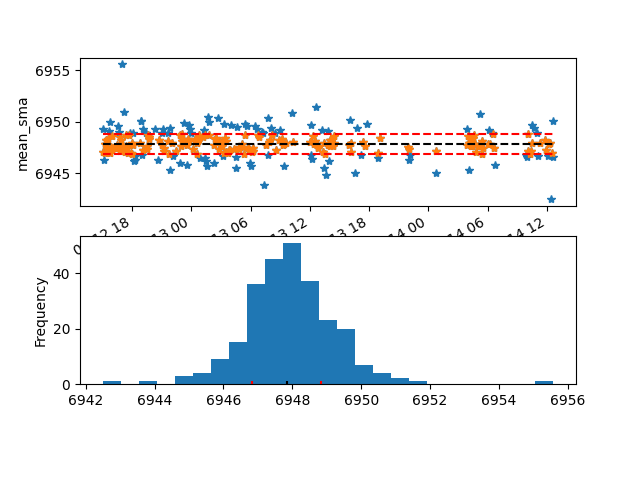
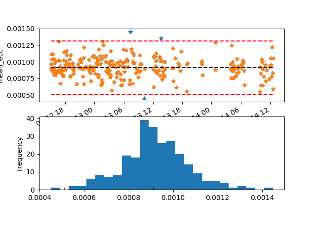
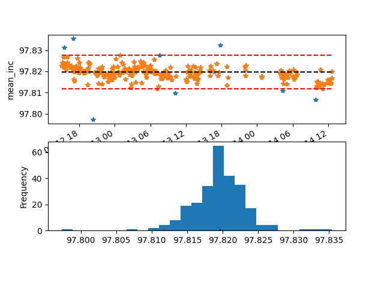
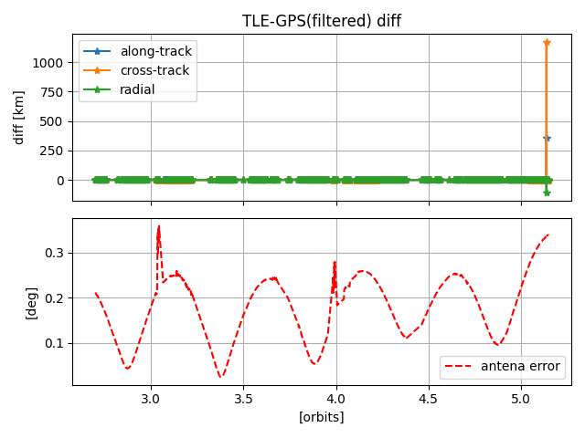
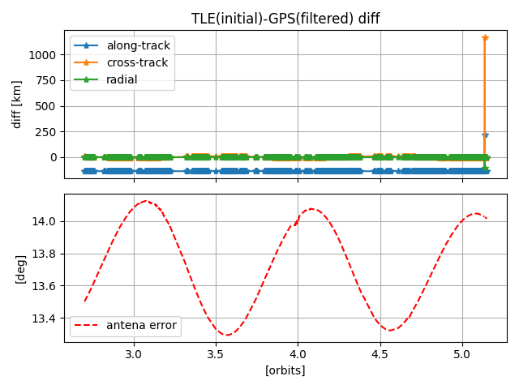

# ORBITFIT

Orbitfit is a software to fit an orbit to a set of GPS points using minimum square method. It can be used with different
propagators by calling to different scripts:
* run_Orekit_fit.py: uses OREKIT's accurate propagator via the python wrapper [orbdetpy](https://github.com/ut-astria/orbdetpy/).
* run_TLE_fit.py: uses SGP4 routine via its python implementation.

# Installation
For the following steps, we recommend using, in windows, anaconda Powershell.

Clone the repository and step into the root directory:

```
git ...
cd orbitfit
```

We recommend using orbitfit with a virtual environment environment (conda in windows) with python>=3.6, though 3.8 is recommended

```
python -m venv -n orbitfit_env python=3.8
source orbitfit_env/bin/activate
pip install .

```

Every time you open the shell, you'll need to rerun the `orbitfit_env/bin/activate` to get into the python virtual
environment that has orbitfit intalled.

## Dependencies
For `run_Orekit_fit.py` script, Orbitfit uses orbdetpy==2.1.0 library, which requires Java Development Kit 11 (11.0.10).
It can be downloaded from [https://www.oracle.com/javadownload](https://www.oracle.com/javadownload). It also requires
that the JAVA_HOME system environment variable to the Java installation folder. Also, add the Java installation folder to
tha systems Path variable. After doing this, restart anaconda or the terminal being used, and check your installation by
typing `java --version`. You should obtain the following output: 
```
(orbdetpy) > java --version
java 11.0.10 2021-01-19 LTS
Java(TM) SE Runtime Environment 18.9 (build 11.0.10+8-LTS-162)
Java HotSpot(TM) 64-Bit Server VM 18.9 (build 11.0.10+8-LTS-162, mixed mode)
```

Finally, orbdetpy also requires to update certain files. This can be done with the command:

 ```
 python -c "from orbdetpy.astro_data import update_data; update_data();"
 ```

If you want just to use `run_TLE_fit.m` script, all the previous dependencies are not used, but you may still have to
install Java so that it doesn't crash when importing orbdetpy.py (not 100% sure about this).

## Runnig run_Orekit_fit.py

The main input of `run_Orekit_fit.py` is a `.pkl` with columns: **ecef_pos_x, ecef_pos_y, ecef_pos_z, ecef_vel_x, ecef_vel_y, ecef_vel_z**, and index being datetime objects.

### Optional inputs
* *--step*: Defines the integration step in seconds. A value of 10 seconds is recommended, though larger values can be 
use if the time range of the data to be fit is long.
  
* *--config*: select which configuration file to use.
  * `stk` to use same propagator settings as default in STK HPOP algorithm.
  * `precise` to use the full model available in Orekit (gravity degree&order up to 90 and Ocean Tides).
  * `config.json`. Orekit configuration dict can be also input from a json file. Moreover, if this file contains the 
    ["Propagation"] key, then this values will be use as initial guess in case the initial and end times match the input
    data times.  
    
  Some spacecraft variables are defined in this config file to be use in the drag model, like: spacecraft **mass**,
  **area**, **drag coefficient** and **reflectivity coefficient**. This values are harcoded to: 

    | parameter | value |
    | ----------- | ----------- |  
    | **mass** | 6 kg |
    | **area** | 0.03 m2 |
    |**drag coefficient** | 2.0|
    |**reflectivity coefficient**| 1.0|

* *--optimize-area*: if selected, spacecraft area will also be consider as an optimization variable, along with the initial
position and velocity. Not recommended to fit data for short periods, but becomes relevant when there is uncertainty on the
  drag parameter and you want to fit the date for a long period.
  
* *--filter-tle*: specify TLE file to use to filter the intial data. Works along with the *--tle-threshold* option. The
  filter is a simple threshold filter around TLE values with a default threshold of 3 km (around TLE error for LEO).
  
* *--filter-mean-oe*: if no argument is pass, it uses default limits to filter GPS input data according to the mean orbital elements.
A simple median filter is used for the Semi-Major axis [km], the Eccentricity and the Inclination [deg]. It's important to 
  filter GPS raw telemetry because it comes with many outliers that can make the fitting algorithm diverge. Running this 
  filter with the option *-p* will show the following plots:
  
  
  
  
## Propulsion optimization options
`run_Orekit_fit.py` also has the capability to include a propulsion maneuver in the propagation, and fit the thrust value 
of that maneuvre to the GPS data. This is very handy when trying to analyse the performance of a propulsion system with
orbital data. A single fit can optimize for multiple individual maneuvers, which is often the case when doing orbital maneuvers
with low thrust propulsion systems. Of course, the ability to optimize for the thrust depends on:
  * The quantity and quality of data between consecutive maneuvers. If this data is poor, it will be difficult to distinguish
both maneuvers.
  * The length of data prior and after the maneuver. We recommend 6hs worth of data have a good match in the thrust.


# Run run_TLE_fit.py

The main input of `run_TLE_fit.py` is the telemetry `.csv` file with the column: **stateVec.calib** (same as with
`run_Orekit_tle.py`), and the initial TLE file. Normally, this initial TLE will be the last available TLE from NORAD.
In the case that there is no initial TLE available, an initial TLE could be estimated from the first GPS point (this
option is currently NOT implemented). The optimization will only change the orbital parameters of the TLE (a, ecco, inclo,
nodeo, argpo, and mo), and bstar drag parameter is the option is selected, keeping all the designator the same, as well
as the TLE epoch.

The repository comes with two examples available:

```
python run_TLE_fit.py TLE_example_1/NSL1_GPS_Test_20210309_gps.pkl TLE_example_1/example_tle.txt -v -s -o TLE_example_1 -p 

2021-07-27 16:59:46,649 - INFO - Creating output file TLE_example_1
2021-07-27 16:59:46,668 - INFO - Load gps data from TLE_example_1/NSL1_GPS_Test_20210309.pkl
2021-07-27 16:59:47,150 - INFO - GPS data available from 2021-03-09 16:08:14.991000 to 2021-03-09 20:04:05.251000
2021-07-27 16:59:47,150 - INFO - Load initial TLE from TLE_example_1/example_tle.txt
2021-07-27 16:59:47,150 - INFO - TLE epoch: 2021-03-09 11:48:50.379264
2021-07-27 16:59:47,150 - INFO - TLE output states:
2021-07-27 16:59:47,150 - INFO - a: 6952.111 [km], T: 94.16470471 [s], ecco: 0.00200660, inclo: 97.7631 [deg], nodeo: 34.0972, argpo: 347.8126, mo: 12.2608 [deg], bstar: 0.00012510
2021-07-27 16:59:47,150 - INFO - Rotate GPS data to ECI
2021-07-27 16:59:47,952 - INFO - Setting up optimizer
2021-07-27 16:59:47,989 - INFO - Plot initial error
INFO:root:Running orbitfit optmization
2021-07-27 16:59:51,399 - ORBITFIT - INFO - -1: 3387.6582348368925
2021-07-27 16:59:51,399 - ORBITFIT - INFO -     state = [0.0018616681854307245, 0.0007487557194139308, 1.0899908591846303, 0.5963894773819742, 0.6422085779043999, 0.9486379622364342, 0.0001251]
2021-07-27 16:59:51,815 - ORBITFIT - INFO - 0: 264.8716645760619
2021-07-27 16:59:51,815 - ORBITFIT - INFO -     state = [0.0018650116697131107, 0.0007585461056577164, 1.0900251944105437, 0.5781599061141334, 0.6433529921482347, 0.948184854628182, 0.016824336427310637]
2021-07-27 16:59:52,170 - ORBITFIT - INFO - 1: 264.85834690482886
2021-07-27 16:59:52,170 - ORBITFIT - INFO -     state = [0.001864995000899598, 0.0007587727608670195, 1.090026128393517, 0.5781654476614879, 0.6433600345632838, 0.9482059707020846, 0.017818689827744143]
2021-07-27 16:59:52,532 - ORBITFIT - INFO - 2: 264.85778859410686
2021-07-27 16:59:52,532 - ORBITFIT - INFO -     state = [0.001864971272693528, 0.0007589521067221735, 1.090027056352505, 0.578180891053092, 0.6433599829108735, 0.9482058677524933, 0.01812621781601944]
2021-07-27 16:59:52,864 - ORBITFIT - INFO - 3: 264.8572415267007
2021-07-27 16:59:52,864 - ORBITFIT - INFO -     state = [0.0018649513103526994, 0.0007591277393718476, 1.090027970206424, 0.5781961287216858, 0.6433599910643567, 0.9482058646866791, 0.018429053830888227]
2021-07-27 16:59:53,202 - ORBITFIT - INFO - 4: 264.85670602580103
2021-07-27 16:59:53,202 - ORBITFIT - INFO -     state = [0.0018649316435982153, 0.0007593007203939105, 1.0900288702483376, 0.5782111361742981, 0.6433599987297387, 0.9482058611273548, 0.01872732555691635]
2021-07-27 16:59:53,202 - INFO - TLE output states:
INFO:root:a: 6952.353 [km], T: 94.15976211 [s], ecco: 0.00201358, inclo: 97.7774 [deg], nodeo: 34.1570, argpo: 347.9965, mo: 10.9755 [deg], bstar: 0.01872733
2021-07-27 16:59:53,202 - INFO - Write TLE to file TLE_example_1\output_TLE.txt
2021-07-27 16:59:53,218 - INFO - Plotting fit (using filtered data)
2021-07-27 17:00:00,058 - INFO - Plotting fit
```




```
python run_TLE_fit.py TLE_example_2/CH01_20210716_GPS_Test4_Rev6-3_rows_0to686_fixed.pkl TLE_example_2/real_tle.txt -v -s -o TLE_example_2 -p --statesize 7

2022-04-11 15:31:12,301 - INFO - Creating output file TLE_example_2
2022-04-11 15:31:12,301 - INFO - Load gps data from TLE_example_2/CH01_20210716_GPS_Test4_Rev6-3_rows_0to686_fixed_gps.pkl
2022-04-11 15:31:12,305 - INFO - GPS data available from 2021-07-12 14:59:41.774000 to 2021-07-14 12:39:43.022000
2022-04-11 15:31:12,306 - INFO - Load initial TLE from TLE_example_2/real_tle.txt
2022-04-11 15:31:12,307 - INFO - TLE epoch: 2021-07-26 10:29:17.262239
2022-04-11 15:31:12,308 - INFO - TLE output states:
2022-04-11 15:31:12,308 - INFO - a: 6950.849 [km], T: 94.19036552 [s], ecco: 0.00189520, inclo: 97.7762 [deg], nodeo: 172.4192, argpo: 236.7873, mo: 123.1532 [deg], bstar: 0.00014366
2022-04-11 15:31:12,308 - INFO - Rotate GPS data to ECI
2022-04-11 15:31:12,528 - INFO - Setting up optimizer
2022-04-11 15:31:12,540 - INFO - Plot initial error
2022-04-11 15:31:15,862 - INFO - Running orbitfit optmization
2022-04-11 15:31:15,875 - ORBITFIT - INFO - -1: 4376.700759721697
2022-04-11 15:31:15,875 - INFO - -1: 4376.700759721697
2022-04-11 15:31:15,875 - ORBITFIT - INFO -     state = [0.0012381999640362726, 0.001434797508033999, 1.0897929609025163, 3.0082442627496704, 0.1511641867550852, -1.1358261461205637, 0.00014366000000000002]
2022-04-11 15:31:15,875 - INFO -        state = [0.0012381999640362726, 0.001434797508033999, 1.0897929609025163, 3.0082442627496704, 0.1511641867550852, -1.1358261461205637, 0.00014366000000000002]
2022-04-11 15:31:15,985 - ORBITFIT - INFO - 0: 471.0041418340192
2022-04-11 15:31:15,985 - INFO - 0: 471.0041418340192
2022-04-11 15:31:15,985 - ORBITFIT - INFO -     state = [0.001112497153116106, 0.0015123744168797696, 1.0897973765931475, 2.9957530555079748, 0.14968976832508823, -1.1360356358127204, 7.223697590774304e-05]
2022-04-11 15:31:15,985 - INFO -        state = [0.001112497153116106, 0.0015123744168797696, 1.0897973765931475, 2.9957530555079748, 0.14968976832508823, -1.1360356358127204, 7.223697590774304e-05]
2022-04-11 15:31:16,091 - ORBITFIT - INFO - 1: 27.302106551744654
2022-04-11 15:31:16,091 - INFO - 1: 27.302106551744654
2022-04-11 15:31:16,091 - ORBITFIT - INFO -     state = [0.0011041923570807568, 0.0015163688689044791, 1.0897984330203438, 2.9899773843692503, 0.14967939278450818, -1.1360480049648483, 5.8108416260173025e-05]
2022-04-11 15:31:16,091 - INFO -        state = [0.0011041923570807568, 0.0015163688689044791, 1.0897984330203438, 2.9899773843692503, 0.14967939278450818, -1.1360480049648483, 5.8108416260173025e-05]
2022-04-11 15:31:16,199 - ORBITFIT - INFO - 2: 0.7921810461861926
2022-04-11 15:31:16,199 - INFO - 2: 0.7921810461861926
2022-04-11 15:31:16,200 - ORBITFIT - INFO -     state = [0.0011020171785866987, 0.0015173125241271183, 1.0897985600704547, 2.9885025496071216, 0.14969219037252054, -1.1360397654435928, 5.524373230314964e-05]
2022-04-11 15:31:16,200 - INFO -        state = [0.0011020171785866987, 0.0015173125241271183, 1.0897985600704547, 2.9885025496071216, 0.14969219037252054, -1.1360397654435928, 5.524373230314964e-05]
2022-04-11 15:31:16,315 - ORBITFIT - INFO - 3: 0.5561490723651534
2022-04-11 15:31:16,315 - INFO - 3: 0.5561490723651534
2022-04-11 15:31:16,316 - ORBITFIT - INFO -     state = [0.0011015396854766873, 0.0015175115871256203, 1.0897984805368715, 2.9882646549964296, 0.14969537098577027, -1.1360377765607335, 5.532858781959711e-05]
2022-04-11 15:31:16,316 - INFO -        state = [0.0011015396854766873, 0.0015175115871256203, 1.0897984805368715, 2.9882646549964296, 0.14969537098577027, -1.1360377765607335, 5.532858781959711e-05]
2022-04-11 15:31:16,427 - ORBITFIT - INFO - 4: 0.7674142302669378
2022-04-11 15:31:16,427 - INFO - 4: 0.7674142302669378
2022-04-11 15:31:16,427 - ORBITFIT - INFO -     state = [0.001101445469488509, 0.001517545787649573, 1.0897983576572874, 2.9883033780560018, 0.14969599175730577, -1.1360373708774003, 5.6058940027117694e-05]
2022-04-11 15:31:16,427 - INFO -        state = [0.001101445469488509, 0.001517545787649573, 1.0897983576572874, 2.9883033780560018, 0.14969599175730577, -1.1360373708774003, 5.6058940027117694e-05]
2022-04-11 15:31:16,428 - INFO - TLE output states:
2022-04-11 15:31:16,428 - INFO - a: 6950.883 [km], T: 94.18966451 [s], ecco: 0.00187513, inclo: 97.7770 [deg], nodeo: 172.4934, argpo: 241.5342, mo: 117.1896 [deg], bstar: 0.00005606
2022-04-11 15:31:16,428 - INFO - Write TLE to file TLE_example_2/output_TLE.txt
2022-04-11 15:31:16,429 - INFO - Plotting fit (using filtered data)
2022-04-11 15:31:21,006 - INFO - Plotting fit
```

The seconds case also optimize for Bstar. Normally, Bstar doesn't change though time, and is correctly estimate by NORAD
after a few weeks, so we don't recommend using this option. It has the advantage that it makes the estimation less robust:
even if the TLE fits correctly the input data, it may degrade rapidly in the future due to an error in the Bstar estimation.

## Recomendations when using run_TLE_fit.py
The problem when getting a TLE from this tool is that you would want it to predict the satellite position in the future.
The TLe fitted may match very accuratelly the provided GPS data, but that doesn't guarantee it will hold that accuracy in
the future. This depends mainly on the two things:
* The quality of the input GPS data: Number of outliers after filtering, length of gaps, noise.
* The length of time. Previous analysis show that the minimum GPS data length to run a succesfull fit is 2 orbits, with
a recommended value of 4 orbits or more. It is more important the length of the data, than the total amount. Data separated
  by 10 minutes in a 90 minutes orbit for 6 orbits is better than 1 sec data for 3 orbits. The frequency of the data does
  impact in the ability to filter it, though.

<!--- TODO: update all that is, it is out of date but I keep it just in case
## With Docker

 TODO: update this for windows... 

Docker llego para resolver todos tus problemas de dependencias (por lo menos desde linux). Para correr orbitfit,
%empezá por exportar los shortcuts:

```
source shortcuts.sh
```

Esto trae dos shortcuts:

* `build`: construye la imagen docker con python3.6 y java, y todas las dependencias requeridas.
* `d`: ejecuta los comandos python dentro de la imagen docker

Finalmente, correr el fiteo con:

```
d run_Orekit_fit.py --sate newsat5 --start "2018-11-12T00:00" --end "2018-11-12T08:00" -v
```

**ACLARACION 1**: Docker no instala orbitfit dentro, solo sirve como cascara para ejecutar el codigo del repositorio,
asegurando que las dependencias como java y python3.6 esten satisfechas.

**ACLARACION 2**: Por algun tema que no logro resolver, a docker no le gust recibir espacion en los argumentos de las
funciones, por lo que hay que reemplazar con `T` el espacio entre fecha y hora, como se ve en el ejemplo.


# Filtering options
Existen dos opciones de filtrado para los datos de GPS: comparando contra el TLE mas cercano, o mirando sus elementos 
orbitales medios. Ambos filtros se puede activar por separado, e incluso pasar como argumento los thresholds a usar.
En caso de que ambos filtros estena activados, perimero se filtra por TLE y luego por mean OE. Por defecto ambos filtros
 estan desactivados.
 
 ## Filtro por TLE
 El filtro por TLE primero rota todos los puntos de GPS de ECI a TEME. Luego descarga de satellops la lista de TLE correspondiente al periodo de
 analisis. Usando los TLE descargados, se propaga y se compara con los puntos GPS en TEME. Luego el filtro descarta todos aquellos
 puntos cuya distancia al TLE sea mayor al threshold selecionado (por defecto 3km). 
 
 Para correr orbitfit con filtro por tle, usar la opcion `-filter-tle`. El argumento a continuación es el threshold en 
 kilometros, y es opcional. Por defecto se usa 3.0 km.
 
 ```
 run_Orekit_fit.py --sate "newsat3" --start "2020-01-18 22:05:02" --end "2020-01-19 06:00:51" -v --filter-tle 3.0
 ```
 
 ## Filtro por Elementos Orbitales medios
 Para aplicar este filtro primero se transforman los puntos GPS ECI en elementos orbitales osculates, y luego elementos
 orbitales medios segun Brouwer. El filtrado se puede realizar sobre el Semi-Eje mayor medio (`mean_sma`), sobre la 
 eccentricidad (`mean_ecc`), o sobre la inclinación (`mean_inc`). El filtrado por sma es por lejos el que mas puntos descarta,
 seguido por el filtrado por ecc. 
 
 La tecnica de filtrado es simple: se calcula la mediana por elemento a filtrar, y luego se eliminan todos los puntos
 que estan a mayor distancia que el threshold selecionado de esa mediana. Los threshold se declaran en formato de
 diccionario. 
 
 Para correr orbitfit con filtro por elementos orbitales medios, usar la opcion `-filter-mean-oe`. El argumento a 
 continuación es el diccionario con los threshold, y es opcional. Por defecto se usa:
  `{"mean_sma": 3.5, "mean_ecc": 0.001, "mean_inc": 0.017}.`.
 
  ```
 run_Orekit_fit.py --sate "newsat3" --start "2020-01-18 22:05:02" --end "2020-01-19 06:00:51" -v --filter-mean-oe
 ```
 
 # Fiteo de maniobras
 Orbitfit tambien ofrece la opción de fitear el empuje y deltaV de una maniobra de propulsión. Por el momento, solo se
  puede fitear una sola maniobra a empuje constante. Este modo no se recomienda con filtro de TLE, ya que es esperable que 
  el TLE deje de servir posterior a la maniobra. Se puede usar el filtro de mean orbital element, el cual se aplicará por
  separado para los datos antes y despues de la maniobra. Para usar este modo, hace falta indicar:
 * El momento en que se inció la maniobra a través de `--propulsion-date`
 * La duración de la maniobra en segundos a través de `--propulsion-time`
 * El modo de la maniobra a través de `--propulsion-mode`. 7 para aumento de SMA y 8 para disminución.
 * El angulo de off plane (rotación alredor del eje a nadir) a través de `--off-plane-angle`.
 
 ```
python run_Orekit_fit.py --sate newsat7 --start "2020-06-11T08:12:15Z" --end "2020-06-11T14:12:15Z" --filter-mean-oe --propulsion-date  "2020-06-11T11:12:15Z" --propulsion-time 123 --propulsion-mode 8 -v
``` 

Ademas de los resultados tipicos de orbitfit, al fitear maniobras se generará un grafico comparativo de elementos 
orbitales medios gps vs fit, y un archivo de maniobra para cargar en Space-Track.

-->
